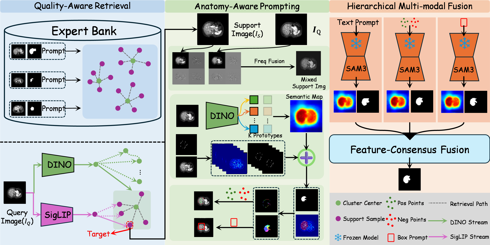
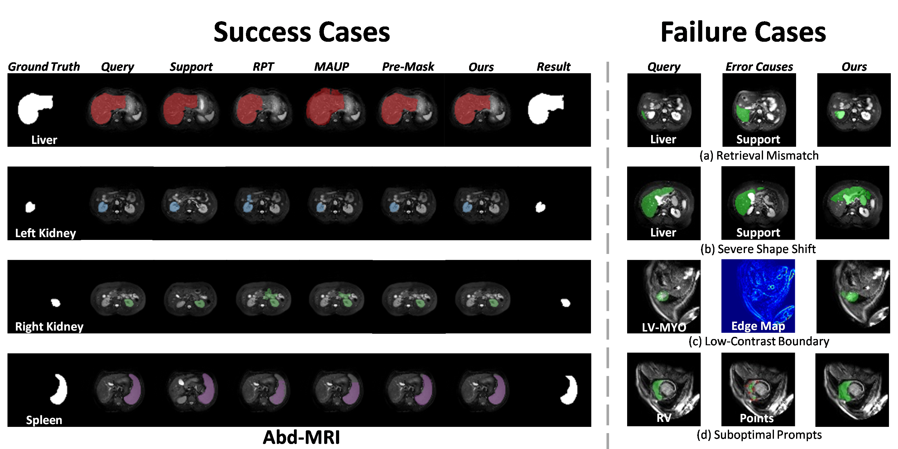

# APEX-SAM: Anatomy-Aware Prompting with Expert Retrieval for Training-Free Medical Image Segmentation

<div align="center">

[](https://miccai.org)
[](LICENSE)
[](https://github.com/Trump0412/APEX-SAM/stargazers)

**[Project Page](https://trump0412.github.io/APEX-SAM/) · [Paper](https://arxiv.org/abs/PLACEHOLDER)**

</div>

---

## Abstract

Training-free cross-domain few-shot medical image segmentation aims to segment unseen anatomies without parameter updates, addressing the high cost of dense annotation and domain-specific fine-tuning in clinical practice. Existing support-driven prompting methods face three limitations: support exemplars are randomly selected without quality assurance, geometric alignment is poorly modeled, and multi-modal prompt capabilities remain underexploited.

We present **APEX-SAM**, a retrieval-augmented framework with three innovations:
- **QAR** — dual-stream DINO/SigLIP expert bank with diversity-aware selection
- **APM** — style-aligned geometric matching and anatomy-guided point sampling
- **HMF** — three SAM branches (point, text, box) fused via training-free feature-consensus weighting

Experiments on three cross-domain benchmarks confirm **+21.1 pp** mean Dice over the strongest training-free baseline.

---

## Method Overview



### QAR — Quality-Aware Expert Retrieval
Builds a hierarchical expert bank by clustering supports via DINO structural keys and greedily selecting entries using a quality-coverage-diversity score. Two-level retrieval routes queries to top-L clusters then re-ranks by multi-modal SigLIP similarity.

### APM — Anatomy-Aware Prompt Mining
Applies Haar DWT style normalization, semantic gating via DINO prototypes, orientation-aware directional Chamfer alignment, and Voronoi-based positive/negative point sampling from morphological priors.

### HMF — Hybrid Multi-Modal Fusion
Runs SAM3 with three independent branches (geometry points, anatomy text, bounding box) and fuses via reliability-weighted feature consensus — no learned parameters required.

---

## Results

### Abd-MRI & Abd-CT (Dice %)

| Method | Ref. | Abd-MRI Mean | Abd-CT Mean |
|--------|------|:---:|:---:|
| PANet | ICCV'19 | 32.46 | 31.94 |
| SSL-ALP | TMI'22 | 63.01 | 47.46 |
| RPT | MICCAI'23 | 46.91 | 48.28 |
| PATNet | ECCV'22 | 52.97 | 57.29 |
| IFA | CVPR'24 | 40.61 | 30.79 |
| FAMNet | AAAI'25 | 65.79 | 64.75 |
| MAUP | MICCAI'25 | 67.09 | 67.46 |
| **APEX-SAM (Ours)** | — | **95.81** | **91.91** |

### Card-MRI (Dice %)

| Method | Ref. | LV-BP | LV-MYO | RV | Mean |
|--------|------|:---:|:---:|:---:|:---:|
| PANet | ICCV'19 | 51.42 | 25.75 | 25.75 | 36.66 |
| FAMNet | AAAI'25 | 86.64 | 51.82 | 76.26 | 71.58 |
| MAUP | MICCAI'25 | 88.36 | 52.74 | 78.29 | 73.13 |
| **APEX-SAM (Ours)** | — | **92.75** | **68.41** | **88.23** | **83.13** |

### Ablation Study (Dice %)

| Configuration | QAR | APM | HMF | Memory | Mean Dice |
|---|:---:|:---:|:---:|:---:|:---:|
| Prompt-only baseline | ✗ | ✗ | ✗ | — | 72.4 |
| + QAR | ✓ | ✗ | ✗ | Fixed | 80.2 |
| + QAR + APM | ✓ | ✓ | ✗ | Fixed | 86.3 |
| + QAR + APM + HMF | ✓ | ✓ | ✓ | Fixed | 91.8 |
| **Full (Ours)** | ✓ | ✓ | ✓ | Thresholded | **95.81** |

---

## Qualitative Results



---

## Installation

```bash
conda create -n apex-sam python=3.10 -y
conda activate apex-sam
pip install -e .
```

Dependencies: `segment_anything`, DINOv3 (local checkout or `torch.hub`).

## Checkpoint Setup

Place checkpoints under `checkpoints/` or override via environment variables:

```bash
export APEX_SAM_CHECKPOINT=./checkpoints/sam_vit_h_4b8939.pth
export APEX_DINO_CHECKPOINT=./checkpoints/dinov3_vitl16_pretrain_lvd1689m-8aa4cbdd.pth
export APEX_DINO_REPO=./third_party/dinov3
```

## Dataset Layout

```
CHAOS_MR_T2_preprocessed/
└── normalized/
    ├── image_000.nii.gz
    ├── label_000.nii.gz
    └── ...
```

## Build Expert Bank

```bash
python -m apex_sam.cli.build_local_db \
  --data-dir /path/to/CHAOS_MR_T2_preprocessed \
  --local-db-path /path/to/CHAOS_MR_T2_local_dinov3_db.npz \
  --dinov3-checkpoint $APEX_DINO_CHECKPOINT \
  --dinov3-repo $APEX_DINO_REPO \
  --device cuda
```

## Run Evaluation

```bash
python -m apex_sam.cli.eval \
  --data-dir /path/to/CHAOS_MR_T2_preprocessed \
  --local-db-path /path/to/CHAOS_MR_T2_local_dinov3_db.npz \
  --max-cases 3 --max-slices 8 --test-labels 1 --retrieval-rank 2 \
  --output-root ./outputs \
  --sam-checkpoint $APEX_SAM_CHECKPOINT \
  --dinov3-checkpoint $APEX_DINO_CHECKPOINT \
  --dinov3-repo $APEX_DINO_REPO \
  --device cuda
```

---

## Citation

```bibtex
@inproceedings{apexsam2026,
  title     = {APEX-SAM: Anatomy-aware Prompting with Expert Retrieval
               for Training-free Medical Image Segmentation},
  author    = {Anonymous Authors},
  booktitle = {Medical Image Computing and Computer Assisted Intervention (MICCAI)},
  year      = {2026},
}
```

## License

This project is released under the [MIT License](LICENSE).
