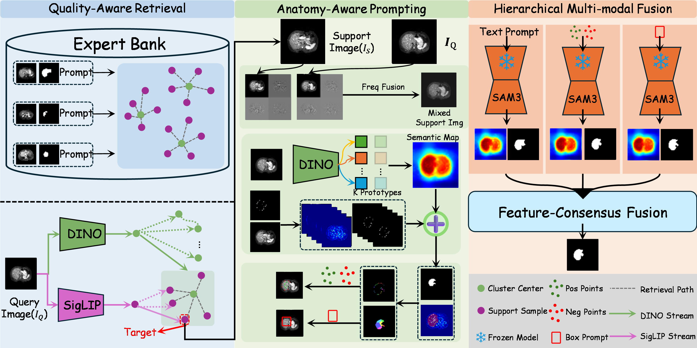

# APEX-SAM

**APEX-SAM: Anatomy-Aware Prompting with Expert Retrieval for Training-Free Medical Image Segmentation**

<div align="center">

[](https://conferences.miccai.org/2026/en/default.asp)
[](https://trump0412.github.io/APEX-SAM/)
[](LICENSE)
[](pyproject.toml)
[](#citation)

</div>

<p align="center">
  <b>MICCAI 2026</b>, Strasbourg, France, Sept. 27 - Oct. 1, 2026.
</p>

<p align="center">
  Zhihao Mao, Bangpu Chen, Qi Lei, Jiaqi Tan, Kun Sun<sup>*</sup><br>
  China University of Geosciences (Wuhan)<br>
  <sup>*</sup>Corresponding author
</p>

<p align="center">
  <a href="https://trump0412.github.io/APEX-SAM/">Project page</a> |
  <a href="https://github.com/Trump0412/APEX-SAM">Code</a> |
  <a href="#citation">Citation</a>
</p>

APEX-SAM is a training-free framework for cross-domain few-shot medical image segmentation. It combines quality-aware expert retrieval, anatomy-aware prompt mining, and hybrid multi-modal prompt fusion to segment unseen anatomy without parameter updates.



## News

- **MICCAI 2026.** APEX-SAM is a MICCAI 2026 paper at the 29th International Conference on Medical Image Computing and Computer Assisted Intervention, Strasbourg, France.
- **Public code.** This repository provides the APM/HMF inference pipeline, preprocessing utilities, evaluation scripts, metrics, tests, and project page assets.
- **Publication metadata.** The paper URL, DOI, LNCS volume, and page numbers will be added after publication.

## Abstract

Training-free cross-domain few-shot medical image segmentation aims to segment unseen anatomies without parameter updates, addressing the high cost of dense annotation and domain-specific fine-tuning in clinical practice. Existing support-driven prompting methods face three limitations: support exemplars are randomly selected without quality assurance, geometric alignment is poorly modeled, and multi-modal prompt capabilities remain underexploited.

We present **APEX-SAM**, a retrieval-augmented framework with three innovations. **QAR** builds a dual-stream DINO/SigLIP expert bank with diversity-aware selection to ensure support-query compatibility. **APM** performs style-aligned geometric matching and anatomy-guided point sampling from morphological priors. **HMF** fuses SAM prompt branches through training-free feature-consensus weighting. Experiments on three cross-domain benchmarks confirm strong performance among training-free methods, with ablations validating each component's contribution.

## What Is Released

This repository contains the public APEX-SAM inference and evaluation code. Restricted medical data, trained/external model weights, and the expert database used by the paper are not redistributed.

Included:

- APM implementation for style normalization, structure matching, pre-mask generation, and prompt sampling.
- HMF implementation for bbox and point prompt branches.
- DINOv3 feature extraction wrapper and SAM backend adapter.
- Preprocessing, single-case inference, full-set evaluation, metrics, configs, tests, and shell scripts.
- GitHub Pages project site assets and citation metadata.

User-provided:

- Medical datasets, following each dataset license.
- SAM-compatible checkpoint and DINOv3 checkpoint.
- Optional external support/expert database. Public inference accepts a selected support item directly.

## Main Results

### Abd-MRI and Abd-CT (Dice %)

| Method | Ref. | Abd-MRI Mean | Abd-CT Mean |
|---|---|---:|---:|
| PANet | ICCV'19 | 32.46 | 31.94 |
| SSL-ALP | TMI'22 | 63.01 | 47.46 |
| RPT | MICCAI'23 | 46.91 | 48.28 |
| PATNet | ECCV'22 | 52.97 | 57.29 |
| IFA | CVPR'24 | 40.61 | 30.79 |
| FAMNet | AAAI'25 | 65.79 | 64.75 |
| MAUP | MICCAI'25 | 67.09 | 67.46 |
| **APEX-SAM (Ours)** | **MICCAI'26** | **95.81** | **91.91** |

### Card-MRI (Dice %)

| Method | Ref. | LV-BP | LV-MYO | RV | Mean |
|---|---|---:|---:|---:|---:|
| PANet | ICCV'19 | 51.42 | 25.75 | 25.75 | 36.66 |
| SSL-ALP | TMI'22 | 83.47 | 22.73 | 66.21 | 57.47 |
| RPT | MICCAI'23 | 60.84 | 42.28 | 57.30 | 53.47 |
| PATNet | ECCV'22 | 65.35 | 50.63 | 68.34 | 61.44 |
| IFA | CVPR'24 | 50.43 | 31.32 | 30.74 | 37.50 |
| FAMNet | AAAI'25 | 86.64 | 51.82 | 76.26 | 71.58 |
| MAUP | MICCAI'25 | 88.36 | 52.74 | 78.29 | 73.13 |
| **APEX-SAM (Ours)** | **MICCAI'26** | **92.75** | **68.41** | **88.23** | **83.13** |

### Ablation (Dice %)

| Configuration | QAR | APM | HMF | Memory Rule | Mean Dice |
|---|---:|---:|---:|---|---:|
| Prompt-only baseline | No | No | No | - | 72.4 |
| + QAR | Yes | No | No | Fixed | 80.2 |
| + QAR + APM | Yes | Yes | No | Fixed | 86.3 |
| + QAR + APM + HMF | Yes | Yes | Yes | Fixed | 91.8 |
| + Full + thresholded append-only (ours) | Yes | Yes | Yes | Thresholded append | **95.81** |

## Repository Layout

```text
apex_sam/
  cli/
    preprocess_dataset.py      # dataset preprocessing
    inference.py               # single-case inference with one support item
    eval.py                    # dataset evaluation with one selected support item
  data/                        # normalized data loading and label remapping
  retrieval/
    dino_encoder.py            # DINOv3 feature extraction and frequency mixing
  premask/                     # structure maps, chamfer matching, pre-mask refinement
  prompting/
    voronoi.py                 # positive/negative point sampling
  pipeline/
    segmenter.py               # APM + HMF segmentation pipeline
  hmf/
    fusion.py                  # bbox/point HMF fusion
  sam/
    predictor.py               # SAM backend adapter
assets/images/                 # project-page figures and result images
checkpoints/                   # local checkpoint notes
configs/                       # example configs
expert_database/               # optional user-managed support assets
scripts/
  run_single_inference.sh
  run_chaos_eval.sh
tests/
```

## Setup

```bash
git clone https://github.com/Trump0412/APEX-SAM.git
cd APEX-SAM

conda create -n apex-sam python=3.10 -y
conda activate apex-sam
pip install -e .
```

Run the lightweight tests:

```bash
PYTHONPATH=. PYTEST_DISABLE_PLUGIN_AUTOLOAD=1 pytest
```

`PYTEST_DISABLE_PLUGIN_AUTOLOAD=1` is optional, but it avoids unrelated global pytest plugins from affecting the test run.

## Model Repositories and Weights

Create a local directory for external model repositories:

```bash
mkdir -p third_party
cd third_party

# DINOv3
git clone https://github.com/facebookresearch/dinov3.git
```

Download checkpoints according to the license and access rules of each model:

```bash
# Hugging Face login may be needed for gated models
hf auth login

# SAM ViT-H
wget -P ./checkpoints https://dl.fbaipublicfiles.com/segment_anything/sam_vit_h_4b8939.pth

# DINOv3 ViT-L/16
huggingface-cli download facebook/dinov3-vitl16-pretrain-lvd1689m --local-dir ./checkpoints/dinov3_vitl16
```

Set paths for this repository:

```bash
export APEX_SAM_CHECKPOINT=/absolute/path/to/sam_vit_h_4b8939.pth
export APEX_DINO_CHECKPOINT=/absolute/path/to/your_dinov3_checkpoint
export APEX_DINO_REPO=/absolute/path/to/third_party/dinov3
```

Use `--device cpu` for smoke tests on machines without CUDA. Full evaluation is expected to run on GPU.

## Data and Support Item Format

The preprocessing command writes normalized NIfTI files under:

```text
CHAOS_MR_T2_preprocessed/
  normalized/
    image_000.nii.gz
    label_000.nii.gz
    image_001.nii.gz
    label_001.nii.gz
```

Single-case inference and evaluation also need a selected support item:

```text
support_item/
  image.npy
  mask_label1.npy
  mask_label2.npy
  ...
```

`image.npy` is a 2D support slice. Each `mask_label{label}.npy` is a binary mask for one target label.

Supported dataset names:

- `CHAOS_MR_T2`
- `CHAOS_CT`
- `MSCMR` / `MS-CMR`
- `SATA_CAP`

Dataset links:

| Dataset | Usage | Link |
|---|---|---|
| CHAOS (CT/MR abdominal) | Abd-MRI / Abd-CT | https://chaos.grand-challenge.org/Data/ |
| MS-CMRSeg 2019 | Card-MRI | https://zmiclab.github.io/zxh/0/mscmrseg19/data.html |
| MICCAI 2013 SATA (CAP split) | additional cross-domain source | https://masi.vuse.vanderbilt.edu/submission/leaderboard.html |

## Preprocess Dataset

```bash
python -m apex_sam.cli.preprocess_dataset \
  --dataset CHAOS_MR_T2 \
  --image-dir /path/to/raw/images \
  --label-dir /path/to/raw/labels \
  --output-dir /path/to/CHAOS_MR_T2_preprocessed
```

Equivalent console script:

```bash
apex-sam-preprocess \
  --dataset CHAOS_MR_T2 \
  --image-dir /path/to/raw/images \
  --label-dir /path/to/raw/labels \
  --output-dir /path/to/CHAOS_MR_T2_preprocessed
```

## Single-Case Inference

```bash
python -m apex_sam.cli.inference \
  --support-item-dir /path/to/support_item \
  --query-image-path /path/to/query_slice.npy \
  --output-mask-path ./outputs/query_pred.npy
```

Equivalent console script:

```bash
apex-sam-infer \
  --support-item-dir /path/to/support_item \
  --query-image-path /path/to/query_slice.npy \
  --output-mask-path ./outputs/query_pred.npy
```

The output is a binary NumPy mask at `--output-mask-path`.

## Evaluation

```bash
python -m apex_sam.cli.eval \
  --data-dir /path/to/CHAOS_MR_T2_preprocessed \
  --support-item-dir /path/to/support_item \
  --output-root ./outputs
```

Defaults:

- `dataset=CHAOS_MR_T2`
- `test_labels` auto-detected from `support_item/mask_label*.npy`
- `max_cases=-1` (all cases)
- `max_slices=-1` (all valid slices)
- `eval_protocol=case_max_filtered`
- `case_dice_threshold=0.1`
- `output_root=./outputs`

Quick smoke evaluation:

```bash
python -m apex_sam.cli.eval \
  --data-dir /path/to/CHAOS_MR_T2_preprocessed \
  --support-item-dir /path/to/support_item \
  --max-cases 3 \
  --max-slices 8
```

Outputs are written under:

```text
outputs/run_YYYYmmdd_HHMMSS/
  run.log
  metrics.csv
  case_metrics.csv
  summary.json
  preds/
  overlays/
```

## Reproducibility Checklist

From a fresh clone, a user should be able to reproduce the public pipeline as follows:

1. Install the package with `pip install -e .`.
2. Download SAM and DINOv3 resources, then set `APEX_SAM_CHECKPOINT`, `APEX_DINO_CHECKPOINT`, and `APEX_DINO_REPO`.
3. Download a supported dataset according to its license.
4. Run `apex-sam-preprocess` to create the normalized dataset folder.
5. Prepare one selected support item with `image.npy` and `mask_label{label}.npy`.
6. Run `apex-sam-infer` for a single query or `apex-sam-eval` for a dataset split.
7. Inspect `summary.json`, `metrics.csv`, `case_metrics.csv`, predictions, and overlays under `outputs/`.

The exact paper numbers depend on the paper's support retrieval database and experimental split settings. The public repository reproduces the released inference/evaluation path with user-provided support items.

## Citation

Text citation:

```text
Mao, Z., Chen, B., Lei, Q., Tan, J., Sun, K.: APEX-SAM: Anatomy-Aware Prompting with Expert Retrieval for Training-Free Medical Image Segmentation. In: Medical Image Computing and Computer Assisted Intervention - MICCAI 2026. Lecture Notes in Computer Science. Springer, Cham (2026).
```

BibTeX:

```bibtex
@inproceedings{mao2026apexsam,
  title     = {APEX-SAM: Anatomy-Aware Prompting with Expert Retrieval for Training-Free Medical Image Segmentation},
  author    = {Mao, Zhihao and Chen, Bangpu and Lei, Qi and Tan, Jiaqi and Sun, Kun},
  booktitle = {Medical Image Computing and Computer Assisted Intervention -- MICCAI 2026},
  series    = {Lecture Notes in Computer Science},
  publisher = {Springer},
  address   = {Cham},
  year      = {2026}
}
```

## License

This project is released under the MIT License. See [LICENSE](LICENSE).
