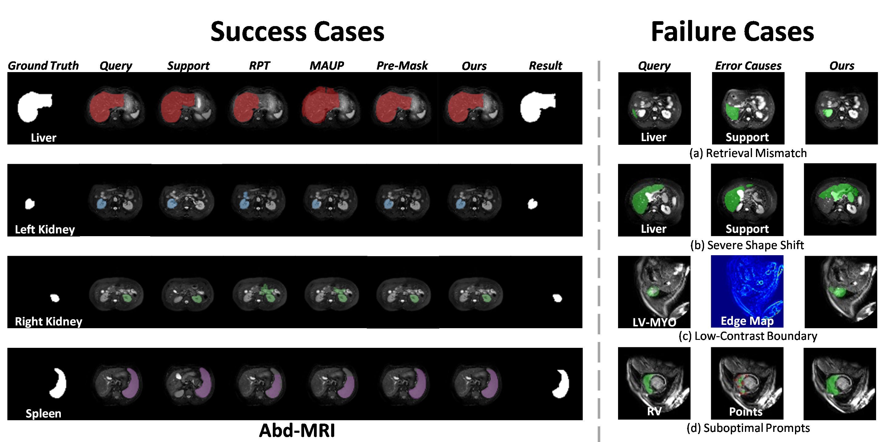

# APEX-SAM

**APEX-SAM: Anatomy-Aware Prompting with Expert Retrieval for Training-Free Medical Image Segmentation**

<div align="center">

[](https://conferences.miccai.org/2026/en/default.asp)
[](https://trump0412.github.io/APEX-SAM/)
[](LICENSE)
[](pyproject.toml)
[](#citation)

</div>

<p align="center">
  <b>MICCAI 2026</b>, Strasbourg, France, Sept. 27 - Oct. 1, 2026.
</p>

<p align="center">
  Zhihao Mao, Bangpu Chen, Qi Lei, Jiaqi Tan, Kun Sun<sup>*</sup><br>
  China University of Geosciences (Wuhan)<br>
  <sup>*</sup>Corresponding author
</p>

<p align="center">
  <a href="https://trump0412.github.io/APEX-SAM/">Project page</a> |
  <a href="https://github.com/Trump0412/APEX-SAM">Code</a> |
  <a href="#citation">Citation</a> |
  Paper coming soon
</p>

APEX-SAM is a training-free framework for cross-domain few-shot medical image segmentation. It combines quality-aware expert retrieval, anatomy-aware prompt mining, and hybrid multi-modal prompt fusion to segment unseen anatomy without parameter updates.


## News

- **MICCAI 2026.** APEX-SAM is a MICCAI 2026 paper at the 29th International Conference on Medical Image Computing and Computer Assisted Intervention, Strasbourg, France.
- **Code released.** This public repository contains the privacy-aware open-source implementation with APM, vanilla HMF, preprocessing, inference, evaluation, scripts, and tests.
- **Paper metadata pending.** The final PDF, DOI, LNCS volume, and page numbers will be added after official publication.

## Abstract

Training-free cross-domain few-shot medical image segmentation aims to segment unseen anatomies without parameter updates, addressing the high cost of dense annotation and domain-specific fine-tuning in clinical practice. Existing support-driven prompting methods face three limitations: support exemplars are randomly selected without quality assurance, geometric alignment is poorly modeled, and multi-modal prompt capabilities remain underexploited.

We present **APEX-SAM**, a retrieval-augmented framework with three innovations. **QAR** builds a dual-stream DINO/SigLIP expert bank with diversity-aware selection to ensure support-query compatibility. **APM** performs style-aligned geometric matching and anatomy-guided point sampling from morphological priors. **HMF** fuses SAM prompt branches through training-free feature-consensus weighting. Experiments on three cross-domain benchmarks confirm strong performance among training-free methods, with ablations validating each component's contribution.

## Highlights

- **Training-free inference:** no parameter update or task-specific fine-tuning is required at test time.
- **Quality-aware retrieval:** expert support candidates are selected by compatibility, coverage, and diversity instead of random sampling.
- **Anatomy-aware prompting:** support-query alignment and morphological priors provide robust point and box prompts.
- **Hybrid prompt fusion:** multiple SAM branches are combined by training-free feature consensus.
- **Privacy-aware release:** private medical data and expert database contents are not redistributed.

## Open-Source Scope

This repository is a public, privacy-aware implementation package. It does **not** include private medical data or the private expert database used in the paper.

Released:

- Module-2 **APM** implementation.
- Module-3 **HMF** vanilla bbox + point implementation.
- Preprocessing, inference, evaluation, metrics, configs, tests, and shell scripts.
- Single-query inference with one externally selected support pair.

Placeholder or user-provided:

- Module-1 **QAR** is kept as file-level placeholders in the public repository.
- DINO/SigLIP-based expert database assets should be built by users under `expert_database/`.
- SAM-compatible checkpoints, DINO/SigLIP weights, and medical datasets must be downloaded according to their own licenses.

## Main Results

### Abd-MRI and Abd-CT (Dice %)

| Method | Ref. | Abd-MRI Mean | Abd-CT Mean |
|---|---|---:|---:|
| PANet | ICCV'19 | 32.46 | 31.94 |
| SSL-ALP | TMI'22 | 63.01 | 47.46 |
| RPT | MICCAI'23 | 46.91 | 48.28 |
| PATNet | ECCV'22 | 52.97 | 57.29 |
| IFA | CVPR'24 | 40.61 | 30.79 |
| FAMNet | AAAI'25 | 65.79 | 64.75 |
| MAUP | MICCAI'25 | 67.09 | 67.46 |
| **APEX-SAM (Ours)** | **MICCAI'26** | **95.81** | **91.91** |

### Card-MRI (Dice %)

| Method | Ref. | LV-BP | LV-MYO | RV | Mean |
|---|---|---:|---:|---:|---:|
| PANet | ICCV'19 | 51.42 | 25.75 | 25.75 | 36.66 |
| SSL-ALP | TMI'22 | 83.47 | 22.73 | 66.21 | 57.47 |
| RPT | MICCAI'23 | 60.84 | 42.28 | 57.30 | 53.47 |
| PATNet | ECCV'22 | 65.35 | 50.63 | 68.34 | 61.44 |
| IFA | CVPR'24 | 50.43 | 31.32 | 30.74 | 37.50 |
| FAMNet | AAAI'25 | 86.64 | 51.82 | 76.26 | 71.58 |
| MAUP | MICCAI'25 | 88.36 | 52.74 | 78.29 | 73.13 |
| **APEX-SAM (Ours)** | **MICCAI'26** | **92.75** | **68.41** | **88.23** | **83.13** |

### Ablation (Dice %)

| Configuration | QAR | APM | HMF | Memory Rule | Mean Dice |
|---|---:|---:|---:|---|---:|
| Prompt-only baseline | No | No | No | - | 72.4 |
| + QAR | Yes | No | No | Fixed | 80.2 |
| + QAR + APM | Yes | Yes | No | Fixed | 86.3 |
| + QAR + APM + HMF | Yes | Yes | Yes | Fixed | 91.8 |
| + Full + thresholded append-only (ours) | Yes | Yes | Yes | Thresholded append | **95.81** |

## Qualitative Results



## Repository Layout

```text
apex_sam/
  cli/
    build_expert_database.py   # Module-1 placeholder CLI
    preprocess_dataset.py      # dataset preprocessing
    inference.py               # single-case inference with one support
    eval.py                    # dataset evaluation with one selected support
  module1_qar/
    build_expert_database.py   # placeholder
    retrieve_support_rank2.py  # placeholder
  pipeline/
    segmenter.py               # APM + vanilla HMF pipeline
  hmf/
    fusion.py                  # bbox + point vanilla fusion
  premask/
  prompting/
  sam/
assets/
  images/                      # project-page figures and result images
expert_database/               # user-managed expert database assets
scripts/
  module1_qar_placeholder.sh
  run_single_inference.sh
  run_chaos_eval.sh
tests/
```

## Setup

```bash
git clone https://github.com/Trump0412/APEX-SAM.git
cd APEX-SAM

conda create -n apex-sam python=3.10 -y
conda activate apex-sam
pip install -e .
```

## Model Repositories and Weights

Create a local directory for external model repositories:

```bash
mkdir -p third_party
cd third_party

# SAM backend
git clone https://github.com/facebookresearch/sam3.git

# DINOv3
git clone https://github.com/facebookresearch/dinov3.git

# SigLIP reference code
git clone https://github.com/google-research/big_vision.git
```

Download checkpoints according to the license and access rules of each model:

```bash
# Hugging Face login may be needed for gated models
hf auth login

# SAM3 / SAM3.1
huggingface-cli download facebook/sam3 --local-dir ./checkpoints/sam3
huggingface-cli download facebook/sam3.1 --local-dir ./checkpoints/sam3_1

# DINOv3 ViT-L/16
huggingface-cli download facebook/dinov3-vitl16-pretrain-lvd1689m --local-dir ./checkpoints/dinov3_vitl16

# SigLIP SO400M
huggingface-cli download google/siglip-so400m-patch14-384 --local-dir ./checkpoints/siglip_so400m
```

Set paths for this repository:

```bash
export APEX_SAM_CHECKPOINT=/absolute/path/to/your_sam_checkpoint
export APEX_DINO_CHECKPOINT=/absolute/path/to/your_dinov3_checkpoint
export APEX_DINO_REPO=/absolute/path/to/third_party/dinov3
```

Use a checkpoint format that matches your installed SAM backend.

## Prepare Data and Support Items

The public code expects preprocessed slices and an externally selected support item:

```text
expert_database/
  ... your externally built assets ...

support_item/
  image.npy
  mask_label1.npy
  mask_label2.npy
  ...
```

Supported dataset names for preprocessing:

- `CHAOS_MR_T2`
- `CHAOS_CT`
- `MSCMR` / `MS-CMR`
- `SATA_CAP`

Dataset links:

| Dataset | Usage | Link |
|---|---|---|
| CHAOS (CT/MR abdominal) | Abd-MRI / Abd-CT | https://chaos.grand-challenge.org/Data/ |
| MS-CMRSeg 2019 | Card-MRI | https://zmiclab.github.io/zxh/0/mscmrseg19/data.html |
| MICCAI 2013 SATA (CAP split) | additional cross-domain source | https://masi.vuse.vanderbilt.edu/submission/leaderboard.html |

## Preprocess Dataset

```bash
python -m apex_sam.cli.preprocess_dataset \
  --dataset CHAOS_MR_T2 \
  --image-dir /path/to/raw/images \
  --label-dir /path/to/raw/labels \
  --output-dir /path/to/CHAOS_MR_T2_preprocessed
```

Equivalent console script:

```bash
apex-sam-preprocess \
  --dataset CHAOS_MR_T2 \
  --image-dir /path/to/raw/images \
  --label-dir /path/to/raw/labels \
  --output-dir /path/to/CHAOS_MR_T2_preprocessed
```

## Inference

Single query with one selected support pair:

```bash
python -m apex_sam.cli.inference \
  --support-item-dir /path/to/support_item \
  --query-image-path /path/to/query_slice.npy
```

Output defaults to `./outputs/inference_pred.npy`.

Custom output path:

```bash
python -m apex_sam.cli.inference \
  --support-item-dir /path/to/support_item \
  --query-image-path /path/to/query_slice.npy \
  --output-mask-path ./outputs/query_pred.npy
```

Equivalent console script:

```bash
apex-sam-infer \
  --support-item-dir /path/to/support_item \
  --query-image-path /path/to/query_slice.npy
```

## Evaluation

Full-set evaluation after Module-1 support selection is implemented or externally prepared:

```bash
python -m apex_sam.cli.eval \
  --data-dir /path/to/CHAOS_MR_T2_preprocessed \
  --expert-database-dir /path/to/expert_database \
  --support-item-dir /path/to/support_item
```

This command uses defaults:

- `dataset=CHAOS_MR_T2`
- `test_labels` auto-detected from `support_item` (`mask_label*.npy`)
- `max_cases=-1` (all cases)
- `max_slices=-1` (all valid slices)
- `eval_protocol=case_max_filtered`
- `case_dice_threshold=0.1`
- `output_root=./outputs`

Quick smoke evaluation:

```bash
python -m apex_sam.cli.eval \
  --data-dir /path/to/CHAOS_MR_T2_preprocessed \
  --expert-database-dir /path/to/expert_database \
  --support-item-dir /path/to/support_item \
  --max-cases 3 \
  --max-slices 8
```

Outputs are written under `./outputs/run_YYYYmmdd_HHMMSS/`.

## Tests

```bash
pip install -e .
pytest
```

The included tests cover configuration loading, metrics, CLI smoke behavior, and placeholder Module-1 behavior.

## What Is Still Pending

- Add the final paper PDF/arXiv link when public.
- Add DOI, LNCS volume, and page range after Springer publication.
- Add final camera-ready BibTeX if the proceedings metadata differs from the current MICCAI 2026 entry.
- Add optional expert-database construction examples if redistributable assets become available.
- Add checkpoint-specific notes once the intended SAM backend and public weights are finalized.

## Citation

MICCAI-style text citation:

```text
Mao, Z., Chen, B., Lei, Q., Tan, J., Sun, K.: APEX-SAM: Anatomy-Aware Prompting with Expert Retrieval for Training-Free Medical Image Segmentation. In: Medical Image Computing and Computer Assisted Intervention - MICCAI 2026. Lecture Notes in Computer Science. Springer, Cham (2026).
```

BibTeX:

```bibtex
@inproceedings{mao2026apexsam,
  title     = {APEX-SAM: Anatomy-Aware Prompting with Expert Retrieval for Training-Free Medical Image Segmentation},
  author    = {Mao, Zhihao and Chen, Bangpu and Lei, Qi and Tan, Jiaqi and Sun, Kun},
  booktitle = {Medical Image Computing and Computer Assisted Intervention -- MICCAI 2026},
  series    = {Lecture Notes in Computer Science},
  publisher = {Springer},
  address   = {Cham},
  year      = {2026}
}
```

## License

This project is released under the MIT License. See [LICENSE](LICENSE).
